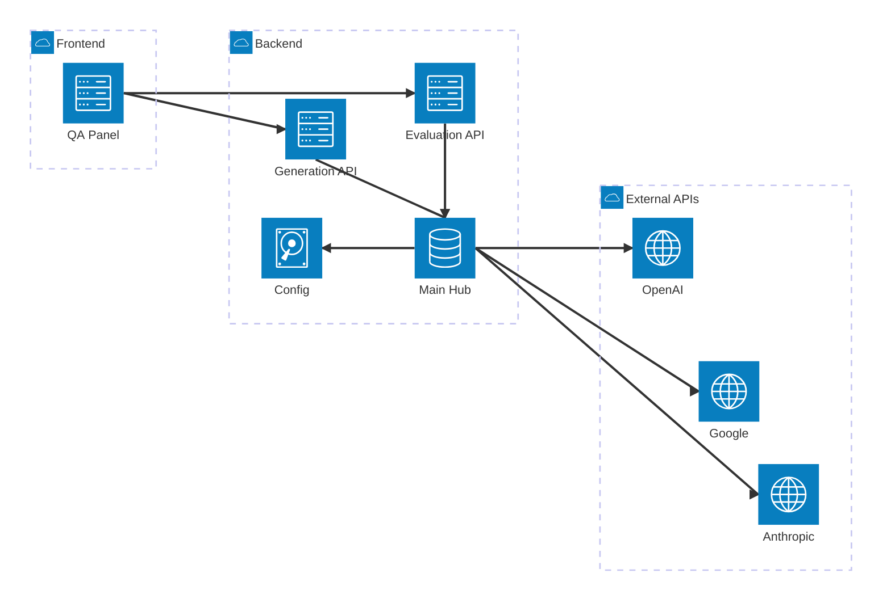
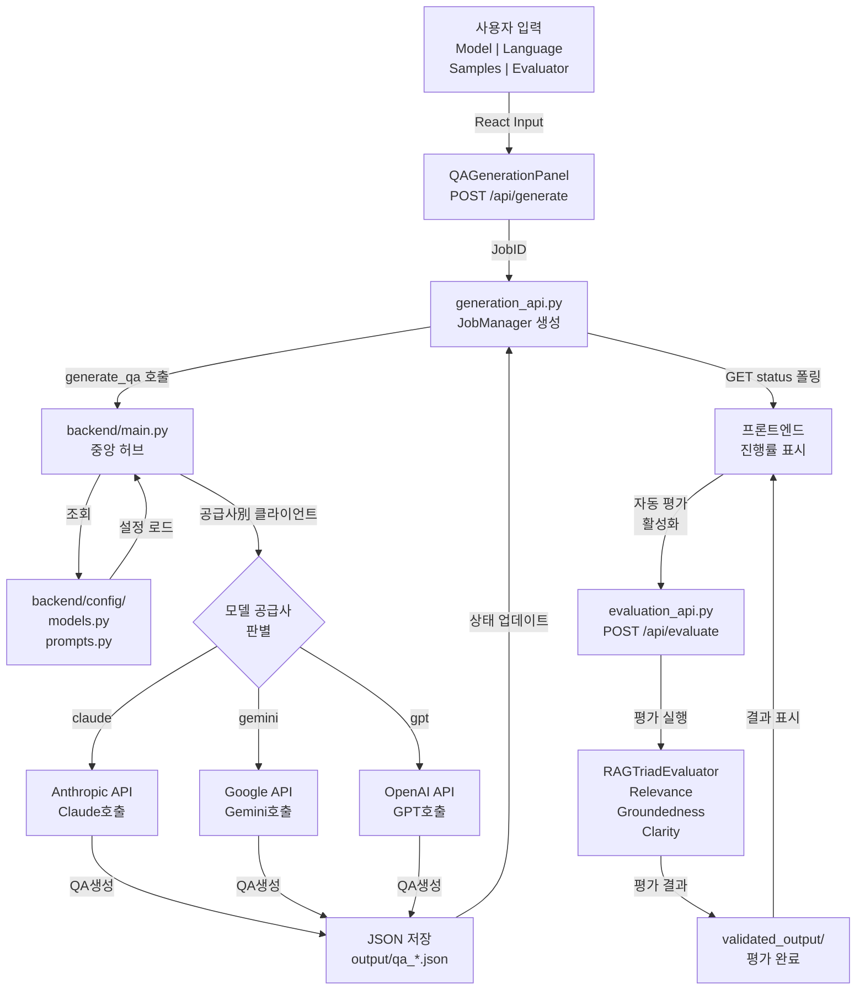
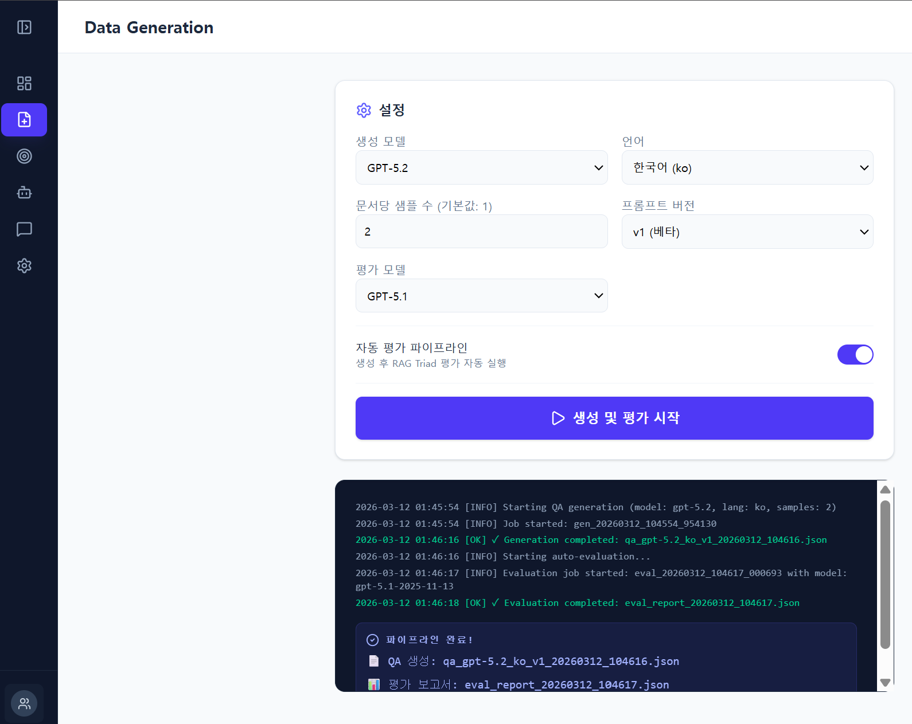

# 🎯 AutoEval: QA 생성 및 평가 시스템

**LLM 기반 자동 QA 생성 및 멀티 모델 평가 플랫폼**

> AI 모델을 활용하여 대규모 고품질 QA 데이터셋을 자동 생성하고, 3가지 평가 모델로 검증하는 엔드-투-엔드 시스템

---

## 📋 목차

1. [시스템 개요](#-시스템-개요)
2. [모델 구성](#-모델-구성)
3. [시스템 아키텍처](#-시스템-아키텍처)
4. [빠른 시작](#-빠른-시작)
5. [실행 방법](#-실행-방법)
6. [디렉토리 구조](#-디렉토리-구조)
7. [개발 노트](#-개발-노트)

---

## 🎯 시스템 개요

### 목표
- **자동 QA 생성**: 3개 선택 모델로 고품질 QA 데이터셋 생성
- **멀티 모델 평가**: 3개의 평가 모델로 생성된 QA를 독립적으로 검증
- **실시간 모니터링**: 웹 대시보드에서 생성/평가 상황 실시간 추적
- **비용 최적화**: 다양한 모델 선택으로 비용 효율적 운영

### 핵심 기능
✅ **QA 자동 생성**: Claude/Gemini/GPT 3개 모델 선택 가능  
✅ **자동 평가**: Relevance/Groundedness/Clarity 3개 지표로 평가  
✅ **실시간 대시보드**: 진행률 모니터링 및 결과 확인  
✅ **한영 지원**: 한국어/영어 자유롭게 선택  
✅ **비용 추적**: 사용한 모든 모델의 토큰 비용 자동 계산  

---

## 💼 모델 구성

### 📝 QA 생성 모델 (3개)

| 모델 | 공급사 | API 명 | 비용 (M토큰) | 특징 |
|------|--------|--------|-------------|------|
| **Claude Sonnet 4.6** | Anthropic | claude-sonnet-4-6 | $3 / $15 | 🏆 최고 품질 |
| **Gemini 3.1 Flash** | Google | gemini-3-flash-preview | $0.30 / $1.2 | ⚡ 최저가 |
| **GPT-5.2** | OpenAI | gpt-5.2-2025-12-11 | $1.75 / $14 | 📊 안정적 |

### 📊 평가 모델 (3개)

| 모델 | 공급사 | API 명 | 비용 (M토큰) | 평가 항목 |
|------|--------|--------|-------------|---------|
| **Claude Haiku 4.5** | Anthropic | claude-haiku-4-5 | $1 / $5 | Relevance, Groundedness, Clarity |
| **Gemini 2.5 Flash** | Google | gemini-2.5-flash | $0.075 / $0.3 | (동일) |
| **GPT-5.1** | OpenAI | gpt-5.1-2025-11-13 | $1.25 / $10 | (동일) |

### 🗂️ 프롬프트 버전

- **V1** ✅ (현재 사용)
  - 한국어: `SYSTEM_PROMPT_KO_V1`, `USER_TEMPLATE_KO_V1`
  - 영어: `SYSTEM_PROMPT_EN_V1`, `USER_TEMPLATE_EN_V1`
  - 위치: `backend/config/prompts.py`

---

## 🏗️ 시스템 아키텍처

### 전체 구조



### 컴포넌트 설명

**Frontend (React 19, Port 5173)**
- `QAGenerationPanel.tsx`: 메인 UI 컴포넌트
  - 생성 모델 선택 (Claude Sonnet/Gemini/GPT)
  - 언어 선택 (한국어/영어)
  - 샘플 수 입력
  - 평가 모델 선택
  - 실시간 진행률 모니터링 (1초 폴링)

**Backend (FastAPI, Port 8000)**
- `backend/main.py`: 중앙 허브
  - 모든 QA 생성 로직 내재
  - `get_client()`: API 클라이언트 팩토리
  - `generate_qa()`: 오케스트레이션 함수
  - MODEL_CONFIG 룩업

- `generation_api.py`: QA 생성 엔드포인트
  - `POST /api/generate`: QA 생성 시작
  - `GET /api/generate/{job_id}/status`: 진행률 조회
  - JobManager: 비동기 작업 추적

- `evaluation_api.py`: QA 평가 엔드포인트
  - `POST /api/evaluate`: 평가 시작
  - `GET /api/evaluate/{job_id}/status`: 결과 조회
  - RAGTriadEvaluator: 3개 지표 평가 (Relevance, Groundedness, Clarity)
  - 자동 공급사 감지 (claude/gemini/gpt)

- `backend/config/`: 중앙 설정
  - `models.py`: 6개 모델 정의 (API 명, 비용)
  - `prompts.py`: V1 프롬프트 (한영)
  - `__init__.py`: 중앙 임포트

**External APIs**
- **Anthropic**: Claude Sonnet 4.6 (생성), Claude Haiku 4.5 (평가)
- **Google**: Gemini 3.1 Flash (생성), Gemini 2.5 Flash (평가)
- **OpenAI**: GPT-5.2 (생성), GPT-5.1 (평가)

### 데이터 플로우



---

## ⚡ 빠른 시작

### 1️⃣ 환경 설정

```bash
cd /home/jpjp92/devs/works/autoeval

# Python 가상 환경 활성화
source .venv/bin/activate

# 또는 uv로 설치
uv sync
```

### 2️⃣ API 키 설정

`.env` 파일 생성:

```env
ANTHROPIC_API_KEY=sk-ant-...
GOOGLE_API_KEY=AIza...
OPENAI_API_KEY=sk-...
```

### 3️⃣ 백엔드 & 프론트엔드 실행

**터미널 1 (백엔드)**
```bash
cd /home/jpjp92/devs/works/autoeval
python -m uvicorn backend.main:app --reload --port 8000
```

**터미널 2 (프론트엔드)**
```bash
cd /home/jpjp92/devs/works/autoeval/frontend
npm install  # 첫 실행만
npm run dev  # http://localhost:5173
```

### 4️⃣ 웹 대시보드 열기

브라우저: `http://localhost:5173`



**대시보드 기능:**
- 🎯 **설정**: 생성 모델, 언어, 샘플 수 선택
- 📊 **평가**: 평가 모델 선택 및 자동 평가 토글
- ▶️ **시작**: "생성 및 평가 시작" 버튼으로 작업 시작
- 📈 **모니터링**: 실시간 진행률 및 로그 확인
- ✅ **결과**: 생성된 QA와 평가 결과 자동 저장

---

## 🖥️ 실행 방법

### 방법 1️⃣: 웹 UI (권장)

```bash
# 백엔드 & 프론트엔드 모두 실행 필수
# http://localhost:5173 에서 사용
# • 모델, 언어, 평가 모델 선택
# • 샘플 수 입력
# • 생성 시작
# • 실시간 진행률 모니터링
```

### 방법 2️⃣: API 직접 호출 (개발용)

```bash
# QA 생성
curl -X POST http://localhost:8000/api/generate \
  -H "Content-Type: application/json" \
  -d '{
    "item": {"content": "Q: ...", "context": "..."},
    "model": "claude-sonnet",
    "lang": "ko",
    "prompt_version": "v1"
  }'

# 진행 상황 확인
curl http://localhost:8000/api/generate/{job_id}/status

# 평가 실행
curl -X POST http://localhost:8000/api/evaluate \
  -H "Content-Type: application/json" \
  -d '{
    "evaluation_model": "claude-haiku",
    "qa_file": "output/qa_*.json"
  }'
```

---

## 📁 디렉토리 구조

```
autoeval/
├── 🔵 backend/
│   ├── main.py                          # FastAPI 중앙 허브 (QA 생성 로직)
│   ├── generation_api.py                # /api/generate 엔드포인트
│   ├── evaluation_api.py                # /api/evaluate 엔드포인트
│   ├── requirements.txt                 # Python 패키지 (백엔드)
│   └── config/
│       ├── __init__.py                  # 중앙 임포트 (V1 프롬프트)
│       ├── models.py                    # 6개 모델 정의 (생성 3, 평가 3)
│       ├── prompts.py                   # V1 프롬프트 (KO/EN)
│       └── constants.py                 # 상수
│
├── 🟣 frontend/
│   ├── index.html                       # HTML 진입점
│   ├── package.json                     # Node 의존성
│   ├── tsconfig.json                    # TypeScript 설정
│   ├── vite.config.ts                   # Vite 설정
│   ├── README.md                        # 프론트엔드 문서
│   └── src/
│       ├── main.tsx                     # React 진입점
│       ├── App.tsx                      # 메인 App 컴포넌트
│       └── components/
│           └── generation/
│               └── QAGenerationPanel.tsx # 메인 UI (모델 선택, 진행률)
│
├── 📊 output/                           # 생성된 QA JSON 파일
│   └── qa_*.json
│
├── 📈 validated_output/                 # 평가 완료된 결과
│   └── evaluated_qa_*.json, qa_quality_results_*.json
│
├── 📁 docs/                             # 문서 및 분석
│   ├── comparison.md                    # 모델 비교 분석
│   ├── hierarchy.md                     # 카테고리 계층
│   ├── pipeline-plan.md                 # 파이프라인 계획
│   └── ...
│
├── 🔍 data_check/                       # 데이터 검증 및 분석
│   ├── normalize_data.py                # 데이터 정규화
│   ├── quality_eval.py                  # 휴리스틱 기반 품질 평가
│   └── analyze_*.py                     # 모델별 분석
│
├── 🧪 test/                             # 테스트 스크립트
│   ├── test_gen1-1.py, test_gen1-2.py   # Claude Sonnet
│   ├── test_gen2-1.py, test_gen2-2.py   # Gemini (구)
│   ├── test_gen3-1.py, test_gen3-2.py   # GPT-5.1
│   └── ...
│
├── 📚 ref/                              # 참고 데이터
│   ├── category.csv, hierarchy.csv      # 분류 정보
│   ├── 고객지원.md, 상품.md, ...         # 카테고리별 문서
│   └── data/                            # 원본 데이터
│
├── 🌐 dashboard_sample/                 # 대시보드 샘플 HTML
│   └── index.html
│
├── 📄 DEV_260311.md                     # 개발 세션 로그 (최신)
├── pyproject.toml                       # Python 환경 설정 (uv)
├── .env                                 # API 키 (git ignored)
└── README.md                            # 이 파일
```

---

## 📖 개발 노트

### 최근 업데이트 (2025-03-11)

#### ✅ 완료된 작업

1. **모델 정품화**: 
   - 생성: Claude Sonnet 4.6, Gemini 3.1 Flash, GPT-5.2 (3개)
   - 평가: Claude Haiku 4.5, Gemini 2.5 Flash, GPT-5.1 (3개)
   - 모든 모델 `backend/config/models.py`에 중앙 정의

2. **프롬프트 마이그레이션**:
   - V2 → V1 완전 전환
   - `backend/config/prompts.py` 에 한영 V1 프롬프트 통합
   - `backend/config/__init__.py` 임포트 업데이트

3. **백엔드 중앙화**:
   - `backend/main.py` 를 중앙 허브로 설정
   - 5개 QA 생성 함수 추가:
     - `get_client(provider)`: API 클라이언트 팩토리
     - `generate_qa_anthropic()`, `generate_qa_google()`, `generate_qa_openai()`: 공급사별 구현
     - `generate_qa()`: 메인 오케스트레이션 + MODEL_CONFIG 룩업

4. **평가 API 강화**:
   - 3-공급사 지원 구현
   - `RAGTriadEvaluator` 자동 공급사 감지 (claude/gemini/gpt)
   - 3개 평가 지표: Relevance, Groundedness, Clarity

5. **GitHub 배포**:
   - 59개 파일, 26,117 라인 커밋
   - URL: https://github.com/jpjp92/autoeval
   - 병합 커밋 완료 (README.md 충돌 해결)

#### 🔧 주요 수정사항

| 파일 | 변경 사항 | 상태 |
|------|---------|------|
| `backend/config/__init__.py` | V2 → V1 임포트 | ✅ 완료 |
| `backend/generation_api.py` | 기본 모델 gemini-3.1-flash 설정 | ✅ 완료 |
| `backend/config/models.py` | gemini-3-flash-preview (정확한 API 명) | ✅ 완료 |
| `backend/evaluation_api.py` | 3-공급사 RAGTriadEvaluator | ✅ 완료 |
| `frontend/src/...` | 모델 드롭다운 정렬 (알파벳) | ✅ 완료 |

#### 📚 참고 문서

- **[DEV_260311.md](DEV_260311.md)**: 전체 세션 로그 및 파이프라인 검증
- **[docs/comparison.md](docs/comparison.md)**: 모델 상세 비교
- **[backend/README.md](backend/README.md)**: 백엔드 API 문서
- **[frontend/README.md](frontend/README.md)**: 프론트엔드 셋업 가이드

---

## 🚀 다음 단계

### 즉시
- [ ] 각 모델(Claude Sonnet, Gemini 3.1 Flash, GPT-5.2)로 생성 테스트
- [ ] 각 평가 모델(Claude Haiku, Gemini 2.5 Flash, GPT-5.1)로 평가 테스트
- [ ] end-to-end 파이프라인 검증

### 단기
- [ ] 성능 벤치마크 (생성/평가 시간, 토큰, 비용)
- [ ] 대규모 배치 생성 최적화
- [ ] CI/CD 파이프라인 구축

### 중기
- [ ] 데이터베이스 통합 (결과 영속성)
- [ ] 고급 필터링 (의도별, 난이도별, 범주별)
- [ ] 평가 결과 시각화 개선

---

## 📞 지원

문제 발생 시:
1. [DEV_260311.md](DEV_260311.md) 에서 관련 섹션 확인
2. [docs/](docs/) 폴더의 문서 참고
3. `backend/` 및 `frontend/` README 참고

---

**Last Updated**: 2025-03-11  
**Repository**: https://github.com/jpjp92/autoeval  
**Branch**: main  
**Commit**: cf8d14b (Merge: Keep local README, add remote source)
