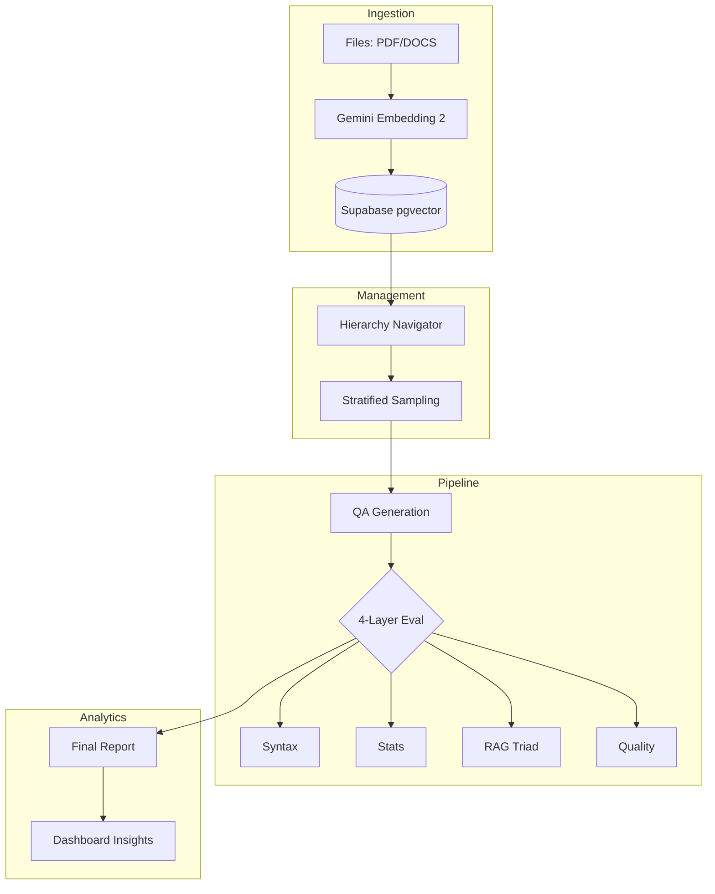

# 🎯 AutoEval: QA 생성 및 평가 시스템

**LLM 기반 자동 QA 생성, 계층형 컨텍스트 관리 및 멀티 모델 평가 플랫폼**

> **Gemini Embedding 2**와 **Supabase Vector DB**를 활용하여 데이터 규격화부터 계층별 QA 생성, 정밀 평가, 인사이트 리포트까지 제공하는 엔드-투-엔드 시스템

---

## 📋 목차

1. [시스템 워크플로우](#-시스템-워크플로우)
2. [핵심 기술 스택](#-핵심-기술-스택)
3. [모델 및 레이트 리밋](#-모델-구성-및-rate-limit)
4. [빠른 시작](#-빠른-시작)
5. [디렉토리 구조](#-디렉토리-구조)
6. [개발 노트](#-개발-노트)

---

## 🔄 시스템 워크플로우

본 시스템은 데이터의 품질과 관리 효율성을 극대화하기 위해 다음 4단계 프로세스를 따릅니다.

1.  **데이터 규격화 (Standardization)**: 다양한 문서(PDF, DOCS 등)를 **Gemini Embedding 2**를 통해 정형화된 벡터 데이터로 변환하여 **Supabase pgvector**에 통합 관리합니다.
2.  **계층 기반 구성 (Hierarchy)**: 규격화된 데이터를 바탕으로 서비스 구조(Level 1~3)를 분류하고, 검색 가능한 **Hierarchy Navigator**를 통해 문서를 정밀하게 타겟팅합니다.
3.  **데이터 생성 및 평가 (QA Pipeline)**: 타겟팅된 계층에 대해 **균형 샘플링**과 **중복 방지** 로직을 적용하여 고품질 QA를 생성하고, 4단계 병렬 평가 파이프라인으로 검증합니다.
4.  **리포트 및 인사이트 (Reporting)**: 평가 결과를 종합하여 계층별 품질 점수와 취약 카테고리 분석 리포트를 제공합니다.

---

## 🛠️ 핵심 기술 스택

- **Frontend**: React 19, Tailwind CSS, Lucide icons (Glassmorphism & Neo Brutalism 테마 적용)
- **Backend**: FastAPI (Python 3.12+), Uvicorn
- **Database**: Supabase (PostgreSQL + **pgvector**)
- **Embeddings**: **Gemini Embedding 2** (text-multimodal-embedding-002) - 3072 dims
- **Orchestration**: Custom JobManager for parallel processing

---

## 💼 모델 구성 및 Rate Limit

### 📝 QA 생성 및 임베딩 모델

| 모델                   | 용도          | API 명                        | RPM   | TPM  | 특징                 |
| ---------------------- | ------------- | ----------------------------- | ----- | ---- | -------------------- |
| **Gemini Embedding 2** | 데이터 규격화 | text-multimodal-embedding-002 | 3,000 | 1M   | 🖼️ 네이티브 멀티모달 |
| **Claude Sonnet 4.6**  | 고품질 생성   | claude-sonnet-4-6             | 50    | 30K  | 🏆 최고 추론 성능    |
| **Gemini 3.1 Flash**   | 고속 생성     | gemini-3-flash-preview        | 1,000 | 2M   | ⚡ 압도적 속도/비용  |
| **GPT-5.2**            | 범용 생성     | gpt-5.2-2025-12-11            | 500   | 500K | 📊 높은 안정성       |

### 📊 평가 모델

| 모델                 | API 명             | RPM   | TPM  | 역할                     |
| -------------------- | ------------------ | ----- | ---- | ------------------------ |
| **Claude Haiku 4.5** | claude-haiku-4-5   | 50    | 50K  | RAG Triad & Quality Eval |
| **Gemini 2.5 Flash** | gemini-2.5-flash   | 1,000 | 1M   | (동일)                   |
| **GPT-5.1**          | gpt-5.1-2025-11-13 | 500   | 500K | (동일)                   |

---

## 🏗️ 시스템 아키텍처



---

## ⚡ 빠른 시작

1.  **환경 설정**: `uv sync` 또는 `pip install -r backend/requirements.txt`
2.  **API 키**: `.env` 파일에 `ANTHROPIC_API_KEY`, `GOOGLE_API_KEY`, `OPENAI_API_KEY`, `SUPABASE_URL`, `SUPABASE_KEY` 설정
3.  **실행**:
    - Backend: `python -m uvicorn backend.main:app --reload`
    - Frontend: `cd frontend && npm run dev`

---

## 📁 디렉토리 구조 (Repository 기반)

```
autoeval/
├── 🔵 backend/
│   ├── main.py                          # FastAPI 중앙 허브 (QA 생성 로직)
│   ├── generation_api.py                # /api/generate 엔드포인트
│   ├── evaluation_api.py                # /api/evaluate 엔드포인트
│   ├── requirements.txt                 # Python 패키지 (백엔드)
│   └── config/                          # 중앙 설정 (모델, 프롬프트, 상수)
│
├── 🟣 frontend/
│   ├── index.html                       # HTML 진입점
│   ├── package.json                     # Node 의존성
│   ├── vite.config.ts                   # Vite 설정
│   └── src/                             # React 소스 코드
│       ├── App.tsx                      # 메인 App 컴포넌트
│       └── components/                  # UI 컴포넌트 (generation, evaluation 등)
│
├── 📚 ref/                              # 참고 데이터
│   └── *.json                           # 계층 및 도메인 지식 데이터 (Git Tracked)
│
├── 📁 docs/                             # 상세 분석 및 가이드 문서
│   ├── gemini_embedding.md              # Gemini Embedding 2 활용 가이드
│   ├── comparison.md                    # 모델 상세 비교
│   └── hierarchy.md                     # 카테고리 계층 구조 데이터
│
├── IMPLEMENTATION_PLAN.md               # 메인 실행 계획 (Approved)
├── DEV_260312.md                        # 개발 세션 로그 (2026-03-12)
├── pyproject.toml                       # Python 환경 설정 (uv)
└── README.md                            # 프로젝트 개요
```

---

## 📖 개발 노트

### 최근 업데이트 (2026-03-12)

#### ✅ 완료된 작업
1.  **UI/UX 단순화**: 'Models' 탭을 제거하고 핵심 워크플로우(생성, 평가)에 집중하도록 사이드바 및 레이아웃 개편.
2.  **시스템 워크플로우 재정립**: 데이터 규격화(Standardization) -> 계층 구성(Hierarchy) -> QA 생성/평가(Pipeline) -> 리포트 구성의 4단계 프로세스 확립.
3.  **데이터 규격화 설계**: Gemini Embedding 2와 Supabase Vector DB(`pgvector`)를 활용한 대용량 문서 처리 및 유사도 검색 기반 QA 생성 설계 완료.
4.  **문서화 고도화**: `IMPLEMENTATION_PLAN.md` 및 `README.md`를 신규 4단계 워크플로우에 맞춰 전면 개편.

#### 🔧 주요 수정사항
-   `frontend/src/App.tsx` & `Sidebar.tsx`: 'Models' 메뉴 및 관련 로직 제거.
-   `README.md`: 4단계 워크플로우 및 최신 기술 스택(Gemini Embedding 2) 반영.
-   `DEV_260312.md`: Gemini Embedding 2의 공식 스펙 및 Rate Limit 정보 기록.

---

## 📚 참고 문서

시스템 구성 및 기술적 상세 내용은 다음 문서들을 참고하십시오.

-   **[IMPLEMENTATION_PLAN.md](IMPLEMENTATION_PLAN.md)**: 전체 통합 실행 계획 (2026-03-12 기준)
-   **[DEV_260312.md](DEV_260312.md)**: 최신 개발 로그, 모델 설정 및 Rate Limit 정보
-   **[docs/gemini_embedding.md](docs/gemini_embedding.md)**: Gemini Embedding 2 모델 활용 방법 (공식 문서 기반)
-   **[docs/comparison.md](docs/comparison.md)**: 모델별 성능 및 비용 비교 분석

---

## 🚀 다음 단계 (Next Steps)

### 1️⃣ Phase 1: 데이터 규격화 (진행 예정)
- [ ] Supabase `doc_chunks` 테이블 생성 및 `pgvector` 인덱스 구축 (SQL).
- [ ] `backend/ingestion_api.py` 구현: PDF/DOCS 파싱 및 Gemini 임베딩 연동.
- [ ] 프론트엔드 문서 업로드 드래그&드롭 컴포넌트 구현.

### 2️⃣ Phase 3: 데이터 생성 및 평가 (QA Pipeline)
- [ ] 계층 기반 샘플링 및 중복 방지 로직 고도화.
- [ ] **Page Transition**: 생성 완료 시 Evaluation 페이지로 자동 페이지 전환 구현.

### 3️⃣ Phase 4: 리포트 및 시각화
- [ ] Evaluation 페이지 내 상세 시각화 리포트(차트) 구현.
- [ ] 계층별 품질 분석 및 개선 인사이트 제공.

### 4️⃣ Final Phase: 통합 대시보드
- [ ] 전체 통계 및 모델 성능 비교 최종 정리.

**Last Updated**: 2026-03-12  
**Repository**: https://github.com/jpjp92/autoeval  
**Branch**: main
