# AutoEval

**LLM 기반 QA 자동 생성 및 평가 POC 설계**

PDF/DOCX 문서를 업로드하면 계층 구조 분석 → QA 생성 → 4레이어 품질 평가까지 엔드-투-엔드로 처리합니다.

---

## 목차

1. [전체 플로우](#-전체-플로우)
2. [아키텍처](#-아키텍처)
3. [기술 스택](#-기술-스택)
4. [모델 구성](#-모델-구성)
5. [DB 스키마](#-db-스키마)
6. [빠른 시작](#-빠른-시작)
7. [API 엔드포인트](#-api-엔드포인트)
8. [개발 노트](#-개발-노트)

---

## 전체 플로우

```mermaid
%%{init: {"theme": "base", "themeVariables": {"fontSize": "13px", "lineColor": "#64748b", "primaryTextColor": "#1e293b"}}}%%
flowchart TD
    classDef up  fill:#1e293b,stroke:#0f172a,color:#f8fafc
    classDef s1  fill:#e0e7ff,stroke:#6366f1,color:#1e293b
    classDef s2  fill:#fef9c3,stroke:#ca8a04,color:#1e293b
    classDef s3  fill:#dcfce7,stroke:#16a34a,color:#1e293b
    classDef s4  fill:#ffe4e6,stroke:#e11d48,color:#1e293b
    classDef s5  fill:#f1f5f9,stroke:#64748b,color:#1e293b
    classDef db  fill:#ede9fe,stroke:#7c3aed,color:#3b0764

    UP([📄 PDF / DOCX 업로드])

    A0["STEP 1 · 데이터 규격화"]
    A1[PDF / DOCX 파싱]
    A2[normalize_text — 특수문자 · 줄바꿈 정리]
    A3{content_hash — 중복 확인}
    A4[Gemini Embedding 2 — 1536차원 벡터 변환]
    DB1[(DB 저장: doc_chunks)]

    B0["STEP 2 · 계층 태깅"]
    B1[단계 1 — H1 도출]
    B2[단계 2 — H2/H3 도출]
    B3[단계 3 — 청크별 계층 일괄 적용]
    DB2[(DB 저장: metadata h1/h2/h3)]

    C0["STEP 3 · QA 생성"]
    C1[H1/H2 필터 — 계층 기반 청크 선별]
    C2[도메인 분석 — 대상 도메인 · 의도 파악]
    C3[병렬 QA 생성 — 다중 모델 동시 생성]
    DB3[(DB 저장: qa_gen_results)]

    D0["STEP 4 · QA 평가"]
    D1[Layer 1-A Syntax — 필드 · 길이 검사]
    D2[Layer 1-B Statistics — 다양성 · 중복률]
    D3[Layer 2 RAG Triad — 관련성 · 근거성 · 명확성]
    D4[Layer 3 Quality — 사실성 · 완전성 · 구체성 · 간결성]
    D5[최종 점수 집계 — 구문·통계 ×0.1 / RAG·품질 ×0.4]
    DB4[(DB 저장: qa_eval_results)]

    E0["STEP 5 · 결과 확인"]
    E1[평가 결과 확인 — QA 상세 · 레이어별 점수]
    E2[리포트 내보내기 — CSV / JSON]
    E3[대시보드 — 집계 지표 · 점수 추이 · 등급 분포]

    UP --> A0 --> A1 --> A2 --> A3 --신규--> A4 --> DB1
    A3 --중복 skip--> DB1
    DB1 --> B0 --> B1 --> B2 --> B3 --> DB2
    DB2 --> C0 --> C1 --> C2 --> C3 --> DB3
    DB3 --> D0 --> D1 --> D2 --> D3 --> D4 --> D5 --> DB4
    DB4 --> E0 --> E1 --> E2 --> E3

    class UP up
    class A0,A1,A2,A3,A4 s1
    class B0,B1,B2,B3 s2
    class C0,C1,C2,C3 s3
    class D0,D1,D2,D3,D4,D5 s4
    class E0,E1,E2,E3 s5
    class DB1,DB2,DB3,DB4 db
```



---

### 단계별 상세

#### STEP 1 — 데이터 규격화

| 처리 | 내용 |
|------|------|
| 파싱 | PDF(PyMuPDF) / DOCX(python-docx) — Section-First 청킹, 표 Markdown 변환 |
| 정규화 | 특수문자 치환, 줄바꿈 결합, 짧은 청크 병합 |
| 중복 방지 | SHA-1 `content_hash` 기반 — 동일 청크 INSERT skip |
| 벡터화 | Gemini Embedding 2 (`gemini-embedding-exp-03-07`) — **1536차원** 벡터 변환 |
| 저장 | `doc_chunks` (content, metadata JSONB, embedding vector(1536)) |

#### STEP 2 — 계층 태깅 (3단계)

| 단계 | API | 동작 |
|------|-----|------|
| 단계 1 — H1 도출 | `analyze-hierarchy` | doc_chunks 샘플 → LLM → **대분류 카테고리 3~5개 확정** |
| 단계 2 — H2/H3 도출 | `analyze-h2-h3` | H1 기반 → LLM 1회 → **중·소분류 카테고리 동시 생성** |
| 단계 3 — 청크 태깅 | `apply-granular-tagging` | 청크별 계층 목록에서 **선택만** (신규 생성 금지) — 일괄 적용 |

> 단계 3 완료 후 `doc_chunks.metadata.hierarchy_h1/h2/h3` 업데이트 → 프론트엔드 H1/H2 드롭다운으로 생성 범위 지정

#### STEP 3 — QA 생성

| 단계 | 내용 |
|------|------|
| 계층 기반 청크 선별 | H1/H2 필터 조회, heading·colophon 청크 제외 |
| 도메인 분석 | 샘플 청크 → LLM → 대상 도메인·의도 파악 (job당 1회) |
| 프롬프트 빌드 | `build_user_template` — domain_profile 기반 XML 태그 적응형 구성 |
| 다중 모델 동시 생성 | `ThreadPoolExecutor` — 모델별 worker 수 분리 병렬 실행 |

**생성 규칙**

| 규칙 | 내용 |
|------|------|
| 수량 | 4~8개 유연 조정 (컨텍스트 적합성 기반) |
| 의도 유형 선택 | 근거 있는 유형만, 동일 유형 최대 2회 |
| 다양성 | 우선 그룹(factoid / definition / how) ≤ 50% |
| procedure | 문서에 순서 있는 단계(1→2→3) 명시 시에만 선택 |
| 질문 근거 | 컨텍스트에 명시된 사실/정의/절차에만 한정, 유추 금지 |
| 답변 스타일 | 메타 표현 시작 금지 ("컨텍스트에 따르면" 등) |

#### STEP 4 — QA 평가

| 레이어 | 모듈 | 평가 항목 | 가중치 |
|--------|------|----------|--------|
| Layer 1-A Syntax | `syntax_validator.py` | 필드 존재·타입·길이 검사 | 10% |
| Layer 1-B Statistics | `dataset_stats.py` | 다양성·중복률 통계 | 10% |
| Layer 2 RAG Triad | `rag_triad.py` | 관련성 · 근거성 · 명확성 | 40% |
| Layer 3 Quality | `qa_quality.py` | 사실성 · 완전성 · 구체성 · 간결성 | 40% |

```
final_score = syntax×0.1 + stats×0.1 + rag×0.4 + quality×0.4

A+ (≥0.95) / A (≥0.85) / B+ (≥0.75) / B (≥0.65) / C (≥0.50) / F (<0.50)
```

#### STEP 5 — 결과 확인

| 기능 | 내용 |
|------|------|
| 평가 결과 확인 | QA 상세 · 레이어별 점수 — 평가 탭에서 job 선택 후 조회 |
| 리포트 내보내기 | CSV / JSON 다운로드 |
| 대시보드 | 집계 지표(총 QA·평균 점수·문서 수·통과율) · 점수 추이 · 등급 분포 |

---

## 아키텍처

```
autoeval/
├── backend/
│   ├── Dockerfile                   # Python 3.12-slim + uv, TZ=Asia/Seoul, curl 포함
│   ├── main.py                      # FastAPI 앱 + 라우트 등록 + 로깅 설정
│   │                                  GET /api/dashboard/metrics 포함
│   ├── api/
│   │   ├── ingestion_api.py         # POST /api/ingestion/* — 라우터 + process_and_ingest
│   │   ├── generation_api.py        # POST /api/generation/generate — 병렬 QA 생성 job
│   │   └── evaluation_api.py        # POST /api/evaluation/evaluate — 4레이어 평가 job
│   ├── ingestion/
│   │   └── parsers.py               # 파싱·정규화·필터·청킹 순수 함수 (I/O 없음)
│   ├── generators/
│   │   ├── qa_generator.py          # 프로바이더별 LLM API 호출 + 응답 파싱
│   │   └── domain_profiler.py       # doc_chunks 샘플 → LLM → domain_profile 생성
│   ├── evaluators/
│   │   ├── pipeline.py              # 4레이어 순서 실행 + Supabase 저장
│   │   ├── syntax_validator.py      # Layer 1-A: 구문 검증
│   │   ├── dataset_stats.py         # Layer 1-B: 다양성·중복률 통계
│   │   ├── rag_triad.py             # Layer 2: RAG Triad (XML 프롬프트)
│   │   ├── qa_quality.py            # Layer 3: Quality Score (XML, system/user 분리)
│   │   ├── recommendations.py       # 평가 결과 기반 개선 권고 생성
│   │   └── job_manager.py           # in-memory 평가 job 관리
│   ├── db/                          # Supabase Repository 패키지
│   │   ├── base_client.py           # 클라이언트 초기화, require_client(), health_check()
│   │   ├── qa_generation_repo.py    # QA 생성 결과 저장/조회
│   │   ├── evaluation_repo.py       # 평가 결과 저장/조회
│   │   ├── generation_eval_link.py  # 생성-평가 연결 (linked_evaluation_id)
│   │   ├── doc_chunk_repo.py        # 문서 청크 CRUD + vector 검색
│   │   ├── hierarchy_repo.py        # 계층 목록 조회 / 일괄 업데이트
│   │   └── dashboard_repo.py        # 대시보드 집계 (summary, recent_jobs, grade_dist)
│   └── config/
│       ├── prompts.py               # XML 태그 프롬프트 + 적응형 빌더 (build_user_template)
│       ├── supabase_client.py       # re-export wrapper → backend/db/ 위임 (하위 호환)
│       ├── models.py                # 모델 alias → model_id, cost 매핑
│       └── constants.py             # worker 수 등 기본 상수
│
├── frontend/
│   ├── Dockerfile                   # Node 빌드 → nginx:alpine (프로덕션)
│   ├── Dockerfile.dev               # Node 20-alpine Vite dev server (HMR)
│   ├── nginx.conf                   # SPA 라우팅 + /api/ 리버스 프록시 (resolver 127.0.0.11)
│   └── src/
│       ├── App.tsx                  # 탭 라우팅 + Glassmorphism 배경 (gradient mesh)
│       ├── lib/api.ts               # 백엔드 API 클라이언트 함수
│       └── components/
│           ├── layout/
│           │   ├── Sidebar.tsx          # 글래스 사이드바 (bg-slate-900/95 backdrop-blur-xl)
│           │   └── Header.tsx           # 글래스 헤더 (bg-white/70 backdrop-blur-md)
│           ├── dashboard/
│           │   ├── DashboardOverview.tsx  # 실시간 대시보드 (Supabase 집계 데이터)
│           │   ├── StatsCards.tsx         # 통계 카드 (accent border + glass)
│           │   └── ActivityChart.tsx      # 점수 추이 차트
│           ├── standardization/
│           │   └── DataStandardizationPanel.tsx  # 업로드 + 3-Pass 태깅 UI
│           ├── generation/
│           │   └── QAGenerationPanel.tsx         # H1/H2 드롭다운 + 생성 설정 UI
│           ├── evaluation/
│           │   └── QAEvaluationDashboard.tsx     # 평가 결과 + 레이어별 점수 UI
│           ├── playground/
│           │   └── ChatPlayground.tsx            # LLM 채팅 플레이그라운드
│           └── settings/
│               ├── SettingsPanel.tsx             # 시스템 설정 (Profile / API Keys / Pipeline)
│               └── PipelineFlow.tsx              # ReactFlow 5-스텝 파이프라인 시각화
│
├── docker-compose.yml               # 프로덕션: server(8000) + client(3000), healthcheck
├── docker-compose.dev.yml           # 개발 오버라이드: 소스 볼륨 마운트 + Vite HMR
├── .env.example                     # 환경 변수 템플릿 (ANTHROPIC / GOOGLE / OPENAI / SUPABASE)
└── README.md
```

---

## 기술 스택

| 영역 | 기술 |
|------|------|
| **Frontend** | React 19, TypeScript, Tailwind CSS, Vite, Lucide icons |
| **UI Style** | Glassmorphism Light — gradient mesh 배경, backdrop-blur, accent border |
| **Backend** | FastAPI (Python 3.12+), Uvicorn, uv |
| **Database** | Supabase (PostgreSQL 15 + pgvector), service_role key |
| **Embeddings** | Gemini Embedding 2 (`gemini-embedding-exp-03-07`) — 1536dim, HNSW 인덱스 |
| **Prompt 구조** | XML 태그 (`<role>` `<principles>` `<intent_types>` `<constraints>` `<context>` `<task>`) |
| **병렬 처리** | `ThreadPoolExecutor` — 모델별 worker 수 분리 |

---

## 모델 구성

### QA 생성 모델

| 모델 | RPM | TPM | Workers |
|------|-----|-----|---------|
| GPT-5.2 (`gpt-5.2-2025-12-11`) | 500 | 500K | 5 |
| Gemini 3.1 Flash (`gemini-3-flash-preview`) | 1,000 | 2M | 5 |
| Claude Sonnet 4.6 (`claude-sonnet-4-6`) | 50 | 30K | 2 |

### 평가 모델

| 모델 | RPM | TPM | Workers |
|------|-----|-----|---------|
| GPT-5.1 (`gpt-5.1-2025-11-13`) | 500 | 500K | 8 |
| Gemini 2.5 Flash (`gemini-2.5-flash`) | 1,000 | 1M | 10 |
| Claude Haiku 4.5 (`claude-haiku-4-5`) | 50 | 50K | 2 |

---

## DB 스키마

Supabase (autoeval 프로젝트) — 3개 테이블 + 2개 뷰

| 객체 | 유형 | 설명 |
|------|------|------|
| `doc_chunks` | 테이블 | 문서 청크 + vector(1536) + metadata JSONB |
| `qa_gen_results` | 테이블 | QA 생성 결과 (qa_list JSONB, doc_chunk_ids uuid[]) |
| `qa_eval_results` | 테이블 | 4레이어 평가 결과 + final_score + final_grade |
| `qa_pairs_view` | 뷰 | qa_gen_results.qa_list flat 전개 |
| `evaluation_qa_joined` | 뷰 | qa_eval_results ↔ qa_gen_results 조인 |

### 테이블 연계

```
doc_chunks.id
  ← qa_gen_results.doc_chunk_ids[]   (GIN 인덱스)
  ← qa_gen_results.qa_list[*].docId  (JSONB 내부)

qa_gen_results.id
  ← qa_eval_results.metadata.generation_id

qa_gen_results.linked_evaluation_id
  → qa_eval_results.id
```

### 최종 등급 체계

```
final_score = syntax×0.1 + stats×0.1 + rag×0.4 + quality×0.4

A+ (≥0.95) / A (≥0.85) / B+ (≥0.75) / B (≥0.65) / C (≥0.50) / F (<0.50)
```

---

## 빠른 시작

### 로컬 개발 (권장)

#### 1. 의존성 설치

```bash
# Python (uv 권장, 프로젝트 루트에서 실행)
uv sync

# Node
cd frontend && npm install
```

#### 2. 환경 변수

```bash
# 프로젝트 루트에 .env 파일 생성 (.env.example 참고)
cp .env.example .env
```

```env
ANTHROPIC_API_KEY=...
GOOGLE_API_KEY=...
OPENAI_API_KEY=...
SUPABASE_URL=...
SUPABASE_API_KEY=...   # service_role 키
LOG_LEVEL=INFO
CORS_ORIGINS=http://localhost:3000,http://localhost:5173
```

#### 3. DB 초기화 (최초 1회)

Supabase SQL Editor에서 순서대로 실행:

```
backend/scripts/setup_vector_db.sql       # doc_chunks + match_doc_chunks RPC
backend/scripts/setup_qa_eval_tables.sql  # qa_eval_results, qa_gen_results, 뷰 2개
```

#### 4. 서버 실행

```bash
# Backend (프로젝트 루트에서)
python -m uvicorn backend.main:app --reload
# → http://localhost:8000  |  Swagger: http://localhost:8000/docs

# Frontend (별도 터미널)
cd frontend && npm run dev
# → http://localhost:3000
```

---

### Docker (로컬 환경 통일)

```bash
# 1. 환경변수 준비
cp .env.example .env   # API 키 입력

# 2. 이미지 빌드
docker compose build

# 3. 백그라운드 실행
docker compose up -d

# 4. 로그 확인
docker compose logs -f

# 5. 중지
docker compose down
```

```bash
# 개발 모드 (server --reload + client Vite HMR)
docker compose -f docker-compose.yml -f docker-compose.dev.yml up --build
```

```bash
# 유용한 명령어
docker compose ps                    # 컨테이너 상태 확인
docker compose logs server --tail=50 # server 로그
docker compose logs client --tail=20 # client(nginx) 로그
docker compose restart server        # server만 재시작
docker compose build client          # client 이미지만 재빌드
```

```bash
# 코드 변경 후 반영 방법
# ⚠️  docker compose up -d 만으로는 변경사항이 반영되지 않음 (기존 이미지 재사용)

# Python(백엔드) 변경 시
docker compose restart server

# React/TSX(프론트엔드) 변경 시 — nginx가 컴파일된 정적 파일을 서빙하므로 재빌드 필요
docker compose build client && docker compose up -d client

# 백엔드 + 프론트엔드 모두 변경 시
docker compose up -d --build
```

| 서비스 | 포트 | 설명 |
|--------|------|------|
| client | 3000 | Nginx → SPA + `/api/` 프록시 → server |
| server | 8000 | FastAPI (직접 접근 가능, Swagger `/docs`) |

> **참고**: nginx upstream DNS 지연 문제로 `resolver 127.0.0.11`(Docker 내장 DNS) + `set $upstream` 변수 사용 → 요청 시점 동적 조회

---

## API 엔드포인트

### Ingestion

| 메서드 | 경로 | 설명 |
|--------|------|------|
| `POST` | `/api/ingestion/upload` | PDF/DOCX 업로드 → 청킹 → 임베딩 → doc_chunks 저장 |
| `POST` | `/api/ingestion/analyze-hierarchy` | Pass 1 — H1 master 3~5개 도출 |
| `POST` | `/api/ingestion/analyze-h2-h3` | Pass 2 — H2/H3 master 동시 생성 |
| `POST` | `/api/ingestion/analyze-tagging-samples` | 태깅 미리보기 (DB 업데이트 없음) |
| `POST` | `/api/ingestion/apply-granular-tagging` | Pass 3 — 청크별 hierarchy 일괄 적용 |
| `GET`  | `/api/ingestion/hierarchy-list` | H1/H2/H3 고유 목록 (드롭다운용) |

### Generation

| 메서드 | 경로 | 설명 |
|--------|------|------|
| `POST` | `/api/generate` | QA 생성 job 시작 |
| `GET`  | `/api/generate/{job_id}/status` | 생성 job 상태 조회 |
| `GET`  | `/api/generate/{job_id}/preview` | 생성 완료 후 QA 미리보기 (최대 N개, context 포함) |
| `GET`  | `/api/generate/jobs` | 세션 내 전체 job 목록 |
| `DELETE` | `/api/generate/{job_id}` | job 취소 |

### Evaluation

| 메서드 | 경로 | 설명 |
|--------|------|------|
| `POST` | `/api/evaluate` | 4레이어 평가 job 시작 |
| `GET`  | `/api/evaluate/{job_id}/status` | 평가 job 상태 + 레이어별 결과 |
| `GET`  | `/api/evaluate/list` | 세션 내 평가 job 목록 (in-memory) |
| `GET`  | `/api/evaluate/history` | Supabase 저장된 평가 이력 전체 |
| `GET`  | `/api/evaluate/{job_id}/export` | 세션 job QA+점수 상세 내보내기 |
| `GET`  | `/api/evaluate/export-by-id/{eval_id}` | Supabase eval_id 기반 상세 내보내기 |

### System

| 메서드 | 경로 | 설명 |
|--------|------|------|
| `GET` | `/health` | 헬스체크 |
| `GET` | `/api/dashboard/metrics` | 대시보드 집계 데이터 (Supabase) |

---

## 배포 구성 (Render + Vercel)

| 플랫폼 | 역할 | 환경변수 |
| ------ | ---- | -------- |
| Render | FastAPI 백엔드 | `CORS_ORIGINS=https://autoeval-v1.vercel.app` |
| Vercel | React 프론트엔드 | `VITE_API_URL=https://autoeval-uccr.onrender.com` |

- Render는 `PORT` 환경변수를 자동 주입 → `main.py`에서 `os.getenv("PORT", 8000)`으로 대응
- 로컬 개발 시 `VITE_API_URL` 미설정 → `http://localhost:8000` fallback 자동 적용

---

**Last Updated**: 2026-03-20 | **Branch**: main
