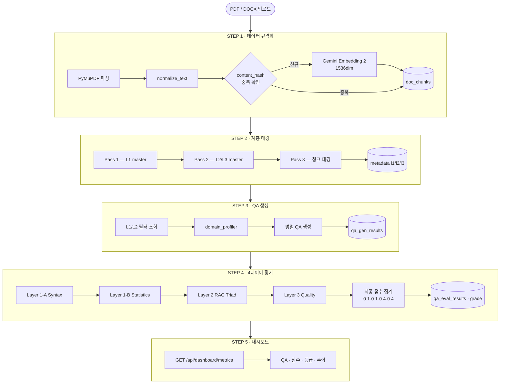

# AutoEval

**LLM 기반 QA 자동 생성 및 다층 평가 플랫폼**

PDF/DOCX 문서를 업로드하면 계층 구조 분석 → QA 생성 → 4레이어 품질 평가까지 엔드-투-엔드로 처리합니다.

---

## 목차

1. [전체 플로우](#-전체-플로우)
2. [아키텍처](#-아키텍처)
3. [기술 스택](#-기술-스택)
4. [모델 구성](#-모델-구성)
5. [DB 스키마](#-db-스키마)
6. [빠른 시작](#-빠른-시작)
7. [API 엔드포인트](#-api-엔드포인트)
8. [개발 노트](#-개발-노트)

---

## 전체 플로우



---

### 단계별 상세

#### STEP 1 — 데이터 규격화

| 처리 | 내용 |
|------|------|
| 파싱 | PyMuPDF → Section-First 청킹 |
| 정규화 | 특수문자(Ÿ 등) 치환, 줄바꿈 결합, 짧은 청크 병합 |
| 중복 방지 | SHA-1 `content_hash` 기반 — 동일 청크 INSERT skip |
| 벡터화 | Gemini Embedding 2 (`gemini-embedding-exp-03-07`) — 1536dim |
| 저장 | `doc_chunks` (content, metadata JSONB, embedding vector) |

#### STEP 2 — 계층 태깅 (3-Pass Master)

| Pass | API | 동작 |
|------|-----|------|
| 1 | `analyze-hierarchy` | doc_chunks 샘플 → LLM → **L1 master 3~5개 확정** |
| 2 | `analyze-l2-l3` | L1 기반 → LLM 1회 → **L2/L3 master 동시 생성** |
| 3 | `apply-granular-tagging` | 청크별 master 목록에서 **선택만** (신규 생성 금지) |

> Pass 3 이후 `doc_chunks.metadata.hierarchy_l1/l2/l3` 업데이트 → 프론트엔드 L1/L2 드롭다운으로 생성 범위 지정

#### STEP 3 — QA 생성

| 단계 | 내용 |
|------|------|
| 청크 조회 | L1/L2 필터, heading·colophon 청크 skip |
| 도메인 분석 | `domain_profiler` — 샘플 → LLM → `domain_profile` (job당 1회) |
| 프롬프트 | `build_user_template` — domain_profile 기반 XML 태그 적응형 빌드 |
| 병렬 생성 | `ThreadPoolExecutor` — 모델별 worker 수 분리 |

**생성 규칙**

| 규칙 | 내용 |
|------|------|
| 수량 | 4~8개 유연 조정 (컨텍스트 적합성 기반) |
| 의도 유형 선택 | 근거 있는 유형만, 동일 유형 최대 2회 |
| 다양성 | 우선 그룹(factoid / definition / how) ≤ 50% |
| procedure | 문서에 순서 있는 단계(1→2→3) 명시 시에만 선택 |
| 질문 근거 | 컨텍스트에 명시된 사실/정의/절차에만 한정, 유추 금지 |
| 답변 스타일 | 메타 표현 시작 금지 ("컨텍스트에 따르면" 등) |

#### STEP 4 — 4레이어 평가

| 레이어 | 모듈 | 평가 항목 | 가중치 |
|--------|------|----------|--------|
| Layer 1-A | `syntax_validator.py` | 필드 존재·길이·포맷 구문 검증 | 10% |
| Layer 1-B | `dataset_stats.py` | 의도 다양성, 중복률, 청크 분포 | 10% |
| Layer 2 | `rag_triad.py` | Context Relevance · Groundedness · Answer Relevance | 40% |
| Layer 3 | `qa_quality.py` | Factuality · Completeness · Groundedness | 40% |

```
final_score = syntax×0.1 + stats×0.1 + rag×0.4 + quality×0.4

A+ (≥0.95) / A (≥0.85) / B+ (≥0.75) / B (≥0.65) / C (≥0.50) / F (<0.50)
```

#### STEP 5 — 대시보드

| 지표 | 내용 |
|------|------|
| 요약 통계 | 총 QA 수, 평균 점수, 문서 수, 통과율 |
| 실행 이력 | 최근 파이프라인 10건 (생성/평가, 모델, QA 수) |
| 등급 분포 | A+/A/B+/B/C/F 건수 + 비율 막대 |
| 점수 추이 | 날짜별 final_score 라인 차트 |

---

## 아키텍처

```
autoeval/
├── backend/
│   ├── main.py                      # FastAPI 앱 + 라우트 등록 + 로깅 설정
│   │                                  GET /api/dashboard/metrics 포함
│   ├── api/
│   │   ├── ingestion_api.py         # POST /api/ingestion/* — 업로드 + 3-Pass 계층 태깅
│   │   ├── generation_api.py        # POST /api/generation/generate — 병렬 QA 생성 job
│   │   └── evaluation_api.py        # POST /api/evaluation/evaluate — 4레이어 평가 job
│   ├── generators/
│   │   ├── qa_generator.py          # 프로바이더별 LLM API 호출 + 응답 파싱
│   │   └── domain_profiler.py       # doc_chunks 샘플 → LLM → domain_profile 생성
│   ├── evaluators/
│   │   ├── pipeline.py              # 4레이어 순서 실행 + Supabase 저장
│   │   ├── syntax_validator.py      # Layer 1-A: 구문 검증
│   │   ├── dataset_stats.py         # Layer 1-B: 다양성·중복률 통계
│   │   ├── rag_triad.py             # Layer 2: RAG Triad (XML 프롬프트)
│   │   ├── qa_quality.py            # Layer 3: Quality Score (XML, system/user 분리)
│   │   ├── recommendations.py       # 평가 결과 기반 개선 권고 생성
│   │   └── job_manager.py           # in-memory 평가 job 관리
│   └── config/
│       ├── prompts.py               # XML 태그 프롬프트 + 적응형 빌더 (build_user_template)
│       ├── supabase_client.py       # DB 클라이언트 + CRUD + get_dashboard_metrics()
│       ├── models.py                # 모델 alias → model_id, cost 매핑
│       └── constants.py             # worker 수, 경로 등 기본 상수
│
├── frontend/src/
│   ├── App.tsx                      # 탭 라우팅 + Glassmorphism 배경 (gradient mesh)
│   ├── lib/api.ts                   # 백엔드 API 클라이언트 함수
│   └── components/
│       ├── layout/
│       │   ├── Sidebar.tsx          # 글래스 사이드바 (bg-slate-900/95 backdrop-blur-xl)
│       │   └── Header.tsx           # 글래스 헤더 (bg-white/70 backdrop-blur-md)
│       ├── dashboard/
│       │   ├── DashboardOverview.tsx  # 실시간 대시보드 (Supabase 집계 데이터)
│       │   ├── StatsCards.tsx         # 통계 카드 (accent border + glass)
│       │   └── ActivityChart.tsx      # 점수 추이 차트
│       ├── standardization/
│       │   └── DataStandardizationPanel.tsx  # 업로드 + 3-Pass 태깅 UI
│       ├── generation/
│       │   └── QAGenerationPanel.tsx         # L1/L2 드롭다운 + 생성 설정 UI
│       ├── evaluation/
│       │   └── QAEvaluationDashboard.tsx     # 평가 결과 + 레이어별 점수 UI
│       ├── playground/
│       │   └── ChatPlayground.tsx            # LLM 채팅 플레이그라운드
│       └── settings/
│           └── SettingsPanel.tsx             # 시스템 설정 (Admin User에서 접근)
│
├── DEV_260318v2.md      # 플로우 & 프롬프트 개선 세션 (2026-03-18)
├── DEV_260318v3.md      # 골든셋 설계 계획
├── DEV_260319.md        # UI 개선 계획 & Glassmorphism 구현 (2026-03-19)
└── README.md
```

---

## 기술 스택

| 영역 | 기술 |
|------|------|
| **Frontend** | React 19, TypeScript, Tailwind CSS, Vite, Lucide icons |
| **UI Style** | Glassmorphism Light — gradient mesh 배경, backdrop-blur, accent border |
| **Backend** | FastAPI (Python 3.12+), Uvicorn, uv |
| **Database** | Supabase (PostgreSQL 15 + pgvector), service_role key |
| **Embeddings** | Gemini Embedding 2 (`gemini-embedding-exp-03-07`) — 1536dim, HNSW 인덱스 |
| **Prompt 구조** | XML 태그 (`<role>` `<principles>` `<intent_types>` `<constraints>` `<context>` `<task>`) |
| **병렬 처리** | `ThreadPoolExecutor` — 모델별 worker 수 분리 |

---

## 모델 구성

### QA 생성 모델

| 모델 | RPM | TPM | Workers |
|------|-----|-----|---------|
| GPT-5.2 (`gpt-5.2-2025-12-11`) | 500 | 500K | 5 |
| Gemini 3.1 Flash (`gemini-3-flash-preview`) | 1,000 | 2M | 5 |
| Claude Sonnet 4.6 (`claude-sonnet-4-6`) | 50 | 30K | 2 |

### 평가 모델

| 모델 | RPM | TPM | Workers |
|------|-----|-----|---------|
| GPT-5.1 (`gpt-5.1-2025-11-13`) | 500 | 500K | 8 |
| Gemini 2.5 Flash (`gemini-2.5-flash`) | 1,000 | 1M | 10 |
| Claude Haiku 4.5 (`claude-haiku-4-5`) | 50 | 50K | 2 |

---

## DB 스키마

Supabase (autoeval 프로젝트) — 3개 테이블 + 2개 뷰

| 객체 | 유형 | 설명 |
|------|------|------|
| `doc_chunks` | 테이블 | 문서 청크 + vector(1536) + metadata JSONB |
| `qa_gen_results` | 테이블 | QA 생성 결과 (qa_list JSONB, doc_chunk_ids uuid[]) |
| `qa_eval_results` | 테이블 | 4레이어 평가 결과 + final_score + final_grade |
| `qa_pairs_view` | 뷰 | qa_gen_results.qa_list flat 전개 |
| `evaluation_qa_joined` | 뷰 | qa_eval_results ↔ qa_gen_results 조인 |

### 테이블 연계

```
doc_chunks.id
  ← qa_gen_results.doc_chunk_ids[]   (GIN 인덱스)
  ← qa_gen_results.qa_list[*].docId  (JSONB 내부)

qa_gen_results.id
  ← qa_eval_results.metadata.generation_id

qa_gen_results.linked_evaluation_id
  → qa_eval_results.id
```

### 최종 등급 체계

```
final_score = syntax×0.1 + stats×0.1 + rag×0.4 + quality×0.4

A+ (≥0.95) / A (≥0.85) / B+ (≥0.75) / B (≥0.65) / C (≥0.50) / F (<0.50)
```

---

## 빠른 시작

### 1. 환경 설정

```bash
# Python (uv 권장)
uv sync

# Node
cd frontend && npm install
```

### 2. 환경 변수

```bash
# backend/.env
GOOGLE_API_KEY=...
OPENAI_API_KEY=...
ANTHROPIC_API_KEY=...
SUPABASE_URL=...
SUPABASE_API_KEY=...   # service_role 키
```

### 3. DB 초기화 (최초 1회)

Supabase SQL Editor에서 순서대로 실행:

```
backend/scripts/setup_vector_db.sql       # doc_chunks + match_doc_chunks RPC
backend/scripts/setup_qa_eval_tables.sql  # qa_eval_results, qa_gen_results, 뷰 2개
```

### 4. 실행

```bash
# Backend
python -m uvicorn backend.main:app --reload

# Frontend (별도 터미널)
cd frontend && npm run dev
```

---

## API 엔드포인트

| 메서드 | 경로 | 설명 |
|--------|------|------|
| `POST` | `/api/ingestion/upload` | PDF/DOCX 업로드 → 청킹 → 임베딩 → DB 저장 |
| `POST` | `/api/ingestion/analyze-hierarchy` | L1 master 생성 (Pass 1) |
| `POST` | `/api/ingestion/analyze-l2-l3` | L2/L3 master 생성 (Pass 2) |
| `POST` | `/api/ingestion/apply-granular-tagging` | 청크별 계층 태깅 (Pass 3) |
| `POST` | `/api/generation/generate` | QA 생성 job 시작 |
| `GET`  | `/api/generation/status/{job_id}` | 생성 job 상태 조회 |
| `POST` | `/api/evaluation/evaluate` | 4레이어 평가 job 시작 |
| `GET`  | `/api/evaluation/status/{job_id}` | 평가 job 상태 조회 |
| `GET`  | `/api/dashboard/metrics` | 대시보드 집계 데이터 |

---

## 개발 노트

### 완료 (2026-03-19)

| 항목 | 내용 |
|------|------|
| **Glassmorphism UI** | gradient mesh 배경, glass 사이드바/헤더/카드, accent border 통일 |
| **Settings 통합** | Settings 탭 제거 → Admin User 클릭 시 Settings 패널 접근 |
| **Header 정리** | 미사용 Search 입력 제거 |
| **Dashboard 실데이터** | 하드코딩 → Supabase 집계 API (`get_dashboard_metrics()`) 연동 |
| **Score Trend 차트** | 토큰 사용량 차트 → 점수 추이 차트로 교체 |

### 완료 (2026-03-18)

| 항목 | 내용 |
|------|------|
| **XML 프롬프트 전환** | 전 파이프라인 (ingestion / generation / evaluation) XML 태그 구조화 |
| **유연 생성 조건** | 8개 고정 → 4~8개, 의도 유형 컨텍스트 기반 선택 + 다양성 규칙 |
| **질문 근거 제약** | 문서에 명시된 사실/정의/절차만 질문화, 메타 표현 시작 금지 |
| **Hierarchy 3-Pass** | L1 확정 → L2/L3 master 동시 생성 → 청크별 선택만 (신규 생성 금지) |
| **평가 프롬프트 개선** | rag_triad.py XML 전환, qa_quality.py system/user 메시지 분리 |
| **E2E 테스트** | 프롬프트엔지니어링.pdf 28/28 Quality 100%, 메타 표현 0건 확인 |

### 다음 작업

| 우선순위 | 항목 |
|---------|------|
| 중 | Supabase jobs 테이블 연계 — 생성/평가 시점 DB 동기화 |
| 중 | Few-shot 예시 추가 — `_build_prompt`에 태깅 예시 삽입 |
| 낮음 | 골든셋 구축 — `qa_golden_set` 테이블 + 자동 후보 추출 (DEV_260318v3.md) |

---

**Last Updated**: 2026-03-19 | **Branch**: main
