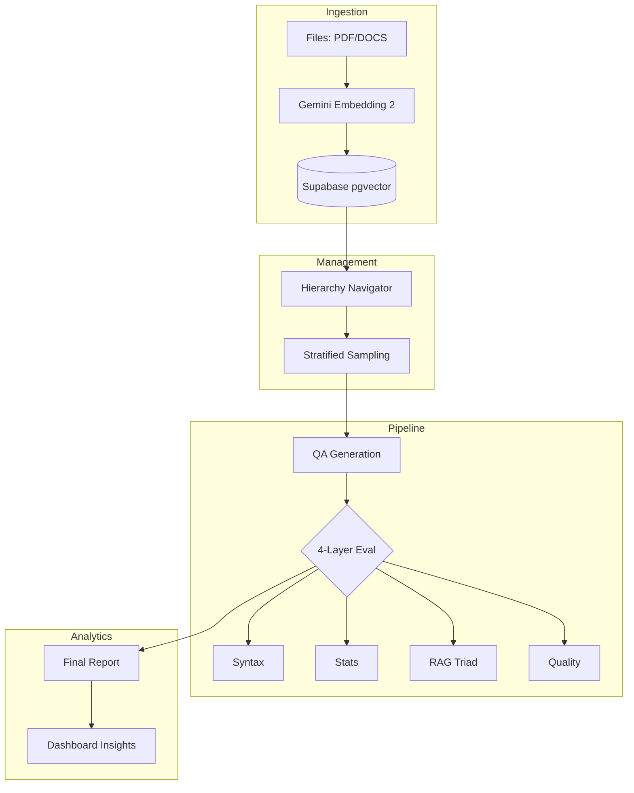

# 🎯 AutoEval: QA 생성 및 평가 시스템

**LLM 기반 자동 QA 생성, 계층형 컨텍스트 관리 및 멀티 모델 평가 플랫폼**

> **Gemini Embedding 2**와 **Supabase Vector DB**를 활용하여 데이터 규격화부터 계층별 QA 생성, 정밀 평가, 인사이트 리포트까지 제공하는 엔드-투-엔드 시스템

---

## 📋 목차

1. [시스템 워크플로우](#-시스템-워크플로우)
2. [핵심 기술 스택](#-핵심-기술-스택)
3. [모델 및 레이트 리밋](#-모델-구성-및-rate-limit)
4. [빠른 시작](#-빠른-시작)
5. [디렉토리 구조](#-디렉토리-구조)
6. [개발 노트](#-개발-노트)

---

## 🔄 시스템 워크플로우

본 시스템은 데이터의 품질과 관리 효율성을 극대화하기 위해 다음 4단계 프로세스를 따릅니다.

1.  **데이터 규격화 (Standardization)**: 다양한 문서(PDF, DOCS 등)를 **Gemini Embedding 2**를 통해 정형화된 벡터 데이터로 변환하여 **Supabase pgvector**에 통합 관리합니다.
2.  **계층 기반 구성 (Hierarchy)**: 규격화된 데이터를 바탕으로 서비스 구조(Level 1~3)를 분류하고, 검색 가능한 **Hierarchy Navigator**를 통해 문서를 정밀하게 타겟팅합니다.
3.  **데이터 생성 및 평가 (QA Pipeline)**: 타겟팅된 계층에 대해 **균형 샘플링**과 **중복 방지** 로직을 적용하여 고품질 QA를 생성하고, 4단계 병렬 평가 파이프라인으로 검증합니다.
4.  **리포트 및 인사이트 (Reporting)**: 평가 결과를 종합하여 계층별 품질 점수와 취약 카테고리 분석 리포트를 제공합니다.

---

## 🛠️ 핵심 기술 스택

- **Frontend**: React 19, Tailwind CSS, Lucide icons (Glassmorphism & Neo Brutalism 테마 적용)
- **Backend**: FastAPI (Python 3.12+), Uvicorn
- **Database**: Supabase (PostgreSQL + **pgvector**)
- **Embeddings**: **Gemini Embedding 2** (text-multimodal-embedding-002) - 3072 dims
- **Orchestration**: Custom JobManager for parallel processing

---

## 💼 모델 구성 및 Rate Limit

### 📝 QA 생성 및 임베딩 모델

| 모델                   | 용도          | API 명                        | RPM   | TPM  | 특징                 |
| ---------------------- | ------------- | ----------------------------- | ----- | ---- | -------------------- |
| **Gemini Embedding 2** | 데이터 규격화 | text-multimodal-embedding-002 | 3,000 | 1M   | 🖼️ 네이티브 멀티모달 |
| **Claude Sonnet 4.6**  | 고품질 생성   | claude-sonnet-4-6             | 50    | 30K  | 🏆 최고 추론 성능    |
| **Gemini 3.1 Flash**   | 고속 생성     | gemini-3-flash-preview        | 1,000 | 2M   | ⚡ 압도적 속도/비용  |
| **GPT-5.2**            | 범용 생성     | gpt-5.2-2025-12-11            | 500   | 500K | 📊 높은 안정성       |

### 📊 평가 모델

| 모델                 | API 명             | RPM   | TPM  | 역할                     |
| -------------------- | ------------------ | ----- | ---- | ------------------------ |
| **Claude Haiku 4.5** | claude-haiku-4-5   | 50    | 50K  | RAG Triad & Quality Eval |
| **Gemini 2.5 Flash** | gemini-2.5-flash   | 1,000 | 1M   | (동일)                   |
| **GPT-5.1**          | gpt-5.1-2025-11-13 | 500   | 500K | (동일)                   |

---

## 🏗️ 시스템 아키텍처



---

## ⚡ 빠른 시작

1.  **환경 설정**: `uv sync` 또는 `pip install -r backend/requirements.txt`
2.  **API 키**: `.env` 파일에 `ANTHROPIC_API_KEY`, `GOOGLE_API_KEY`, `OPENAI_API_KEY`, `SUPABASE_URL`, `SUPABASE_KEY` 설정
3.  **실행**:
    - Backend: `python -m uvicorn backend.main:app --reload`
    - Frontend: `cd frontend && npm run dev`

---

## 📁 디렉토리 구조 (Repository 기반)

```
autoeval/
├── 🔵 backend/
│   ├── main.py                          # FastAPI 중앙 허브 (QA 생성 로직)
│   ├── generation_api.py                # /api/generate 엔드포인트
│   ├── evaluation_api.py                # /api/evaluate 엔드포인트
│   ├── requirements.txt                 # Python 패키지 (백엔드)
│   └── config/                          # 중앙 설정 (모델, 프롬프트, 상수)
│
├── 🟣 frontend/
│   ├── index.html                       # HTML 진입점
│   ├── package.json                     # Node 의존성
│   ├── vite.config.ts                   # Vite 설정
│   └── src/                             # React 소스 코드
│       ├── App.tsx                      # 메인 App 컴포넌트
│       └── components/                  # UI 컴포넌트 (generation, evaluation 등)
│
├── 📚 ref/                              # 참고 데이터
│   └── *.json                           # 계층 및 도메인 지식 데이터 (Git Tracked)
│
├── 📁 docs/                             # 상세 분석 및 가이드 문서
│   ├── gemini_embedding.md              # Gemini Embedding 2 활용 가이드
│   ├── comparison.md                    # 모델 상세 비교
│   └── hierarchy.md                     # 카테고리 계층 구조 데이터
│
├── IMPLEMENTATION_PLAN.md               # 메인 실행 계획 (Approved)
├── DEV_260312.md                        # 개발 세션 로그 (2026-03-12)
├── pyproject.toml                       # Python 환경 설정 (uv)
└── README.md                            # 프로젝트 개요
```

---

## 📖 개발 노트

### 최근 업데이트 (2026-03-16)

#### ✅ 완료된 작업

##### Phase 1 — 데이터 규격화 (Standardization) 파이프라인 구축 완료
1. **`backend/ingestion_api.py` 구현 완료**
   - PyMuPDF 기반 PDF 파싱 (`format_table_as_text`, `extract_text_from_pdf`)
   - `detect_heading()` : 섹션 제목 감지 — 로마자(`Ⅰ. 서론`) 패턴 추가, 불릿 아이템 오분류 방지, 가운뎃점(`·`) 기준 심볼 비율 필터링
   - `detect_repeated_headers()` : 마크다운 표 구분선(`| --- |`) 반복 헤더 오탐 방지
   - `RecursiveCharacterTextSplitter` + 표 청크 중간 분할 복원 (`[표]` 마커 후처리)
   - TOC 청크 자동 필터링 (`is_toc_chunk`)
   - Gemini Embedding 2 벡터화 후 Supabase `doc_chunks` 저장

2. **PDF 파싱 품질 개선**
   - 표 셀 `None` 복원 로직: `page.get_text("words")`로 좌표 기반 셀 내용 재추출
   - 페이지 번호를 `metadata.pages` 배열로 정확히 기록
   - 표 청크에 `[표]` 마커 보존 (스플리터가 소비하지 않도록 후처리 방식으로 전환)

3. **통합 API 엔드포인트**
   - `POST /api/ingestion/upload` — 문서 업로드 및 벡터 저장
   - `POST /api/ingestion/analyze-hierarchy` — AI 기반 L1/L2/L3 계층 분석
   - `POST /api/ingestion/analyze-tagging-samples` — 태깅 샘플 미리보기
   - `POST /api/ingestion/apply-granular-tagging` — DB 전체 계층 태그 반영

##### Phase 2 — 프론트엔드 리팩토링 완료
4. **Standardization + Hierarchy 통합 페이지**
   - `DataStandardizationPanel.tsx`: 업로드 완료 시 Hierarchy 분석 카드가 자동 노출
   - 업로드 → AI 분석 실행 → L1 후보 칩 선택 → 태깅 샘플 미리보기 흐름 구현
   - 사이드바에서 별도 Hierarchy 탭 제거 (`Sidebar.tsx`, `App.tsx` 정리 완료)

#### 🔧 주요 수정 파일

| 파일 | 변경 내용 |
|------|-----------|
| `backend/ingestion_api.py` | PDF 파싱 전면 구현, 표/제목 감지 버그 수정 |
| `frontend/src/components/standardization/DataStandardizationPanel.tsx` | Standardization + Hierarchy 통합 UI |
| `frontend/src/components/layout/Sidebar.tsx` | Hierarchy 탭 제거, `Layers` import 제거 |
| `frontend/src/App.tsx` | HierarchyConstructionPanel import·라우트·타이틀 제거 |

#### 🐛 수정된 버그

| 버그 | 원인 | 수정 |
|------|------|------|
| `\| --- \|` 반복 헤더 오탐 | `detect_repeated_headers`가 표 구분선을 헤더로 인식 | `^[\|\s\-:]+$` 패턴 라인 제외 |
| `- '...'` 불릿 항목이 섹션 제목으로 인식 | `detect_heading` 조건 누락 | `^[-•∙]\s` 얼리 리턴 추가 |
| `Ⅰ. 서론` 미감지 | 심볼 비율 계산 시 `. ` 포함으로 오필터 | 가운뎃점(`·`)만 집계, 최소 15자 조건 추가, 로마자 패턴 추가 |
| page=14 표 청크 소실 | `\n[표]` 구분자가 스플리터에 의해 소비됨 | 구분자 원복, 파이프 시작 청크에 `[표]` 마커 후처리로 복원 |

---

## 📚 참고 문서

-   **[IMPLEMENTATION_PLAN.md](IMPLEMENTATION_PLAN.md)**: 전체 통합 실행 계획
-   **[DEV_260312.md](DEV_260312.md)**: 2026-03-12 개발 로그
-   **[DEV_260313.md](DEV_260313.md)**: 2026-03-13 개발 로그
-   **[docs/gemini_embedding.md](docs/gemini_embedding.md)**: Gemini Embedding 2 활용 가이드
-   **[docs/comparison.md](docs/comparison.md)**: 모델별 성능 및 비용 비교

---

## 🚀 다음 단계 (Next Steps)

---

### Phase 3: QA 생성 파이프라인 고도화

#### 3-1. 코드 레벨 메타데이터 불일치 정리

DB에 저장된 실제 키와 코드 간 혼용이 있어 QA 생성 전 정리 필요.

| 위치 | 현재 코드 | DB 실제 키 | 조치 |
|------|-----------|------------|------|
| `generation_api.py` line 317 | `meta.get("hierarchy_l1")` | `hierarchy_l1` ✅ | 이미 정상 |
| `ingestion_api.py` 일부 | `m.get("pages")` | `page` (단수, int) | `pages` → `page` 통일 |
| `ingestion_api.py` 일부 | `m.get("type")` | `chunk_type` | `type` → `chunk_type` 통일 |
| `generation_api.py` line 303 | `[0.0] * 1536` dummy 벡터 | — | 실제 query embedding 으로 대체 |

**개선 방향**: `ingestion_api.py` 내 `pages`/`type` 참조를 `page`/`chunk_type`으로 일괄 정리하고, `search_doc_chunks` 호출 시 dummy zero vector 대신 QA 주제 키워드 임베딩을 사용해 실제 semantic 검색이 동작하도록 개선.

---

#### 3-2. 계층 + Context 기반 청크 샘플링

현재 `search_doc_chunks`는 hierarchy 필터 + zero vector로 동작하여 사실상 필터링만 수행. 다음 전략으로 고도화:

```
[QA 생성 요청]
    │
    ├─ 1) L1/L2/L3 필터로 후보 청크 풀 구성  (metadata @> filter)
    │
    ├─ 2) chunk_type 가중치 부여
    │      table   → 수치/비교 QA에 적합 (가중치 높음)
    │      list    → 절차/나열 QA에 적합
    │      body    → 설명형 QA에 적합
    │      heading → 단독 사용 X, 다음 청크와 병합
    │
    ├─ 3) section_path 기반 연속 청크 결합
    │      같은 section_path 내 청크들을 합쳐 context window 구성
    │
    └─ 4) 균형 샘플링
           각 L1 도메인에서 비율 맞춰 추출 (편향 방지)
```

- [ ] `chunk_type`별 QA 생성 프롬프트 분기 (`table` → 수치 비교형, `list` → 절차형, `body` → 설명형)
- [ ] `section_path`가 같은 연속 청크를 하나의 context로 결합하는 `build_context_window()` 유틸 구현
- [ ] `keywords` 메타데이터를 QA 생성 힌트로 프롬프트에 삽입
- [ ] 전체 청크 대비 L1별 비율 기반 균형 샘플링 (`total_chunks` 활용)
- [ ] `content_hash` 기반 중복 QA 방지 필터

---

#### 3-3. Semantic 검색 실사용

- [ ] QA 생성 시 `r_query` (검색 쿼리)를 사용자가 입력하거나 L2/L3 레이블로 자동 생성
- [ ] zero vector dummy 방식 제거 → 실제 Gemini Embedding 2 `RETRIEVAL_QUERY` 호출
- [ ] `match_threshold` 동적 조정 (청크 수가 부족할 경우 임계값 완화)

---

### Phase 4: 평가 파이프라인

```
생성된 QA
    │
    ├─ Layer 1: Syntax Check    — 형식 오류, 빈 answer, 길이 검증
    ├─ Layer 2: Stats Check     — 중복률, 언어 일치, 특수문자 비율
    ├─ Layer 3: RAG Triad       — Context Relevance / Answer Faithfulness / QA Relevance
    └─ Layer 4: Quality Score   — 난이도, 명확성, 실용성 종합 점수
```

- [ ] `evaluation_api.py` 4-Layer 평가 병렬 실행 (asyncio.gather)
- [ ] 평가 모델: Claude Haiku 4.5 (RAG Triad) + Gemini 2.5 Flash (Quality Score)
- [ ] `chunk_type`별 평가 기준 차별화 (표 청크는 수치 정확성 추가 검증)
- [ ] 평가 결과를 `qa_generation_results` 테이블에 저장 (generation_id 연결)

---

### Phase 5: 대시보드 & 리포트

- [ ] Dashboard Overview에 L1별 청크 수 / QA 생성 수 / 평가 평균 점수 실시간 반영
- [ ] 계층별 품질 히트맵 (L1 × chunk_type 크로스 분석)
- [ ] 취약 카테고리 자동 감지 및 재생성 권고

---

**Last Updated**: 2026-03-16  
**Repository**: https://github.com/jpjp92/autoeval  
**Branch**: main
